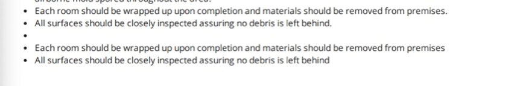

# PDF Template generate and render for Five Boro Mold Corporation

Code to generate the template, merge files, update the code on tadabase, etc.

---

## What works

- Rendering and merging a template locally
- Merging the data locally
- Uploading, running, and retrieving pipes from tada
- Dynamically retrieving data ~~for _most_ of the form values~~
- Fill in the blanks (maybe)
- Et cetera, et cetera

## ~~What's broken~~

- ~~Visual Assessment data (`tada_js.js`, section #1)~~
- ~~Treatment Process data (`tada_js.js`, section #8)~~
  - ~~Fill in the blanks feature~~

## Issues to fix (from Dev Team; May 19, 2023)

1. **Visual assessment** → Color of mold in **room 3** is **not displaying the field**
2. **Visual Assessment** → If **no color** is selected for Room 2 it **shows "air sample was taken"**
3. **Visual Assessment** → **Room 6 is missing**
4. **Damages** → **Room 1**, is **not displaying the field**
5. **Damages** → **Room 3**, types of damages **is blank** even with a field
6. Shows **blank image of image 5 for mold**, even if there was **none put in**
7. ~~Some **Images are getting cropped** out if they have a longer shape (refer to image below)~~
8. **Mold Remediation outline** → is **not displaying the field**
9. **Treatment process**: There are **three bullet points that seem to be** there even when I don't select those fields (refer to screenshot), **and sometimes its is missing the second and third bullet points from the last**

10. **Sampling** → When _other_ is selected it **should not display _other_ but rather the text _inside_ the other mold field**

## Feedback

- Thanks again for all the work you put into the pdf. It really looks great.
- Thank you for all the work you put into the Five Boro Mold PDF. I know it was a massive job and the result really came out great.
- Thank you for the update, I appreciate all your hard work on this.
- Thank you Elliott for following up. Gut Shabbos.

---

## Useful Commands and URL's

Commands:

- `deno run --allow-read run_tada_data_merge.js` - Simulate running the pipe (with local data)
- `deno run --allow-read --allow-net run_pipe.js False oGWN5eqNlA` - Actual test of the pipe
- `rm tada_js_merged.js && deno run --allow-read tada_merge_scripts.js >> tada_js_merged.js` - Generate a JS file with the code that will be sent to the pipe

URL's:

- <https://build.tadabase.io/apps/manage/YZjnq9mQPv>

- <https://app.cloudlayer.io/editor?id=Srh1NZcJmx4HeBuspkfQ>

---

## Explanation of included Files

Template source file

- `pagedjs.html` - Template source file
- `pagedjs.css` - Main CSS file of template

- `paged_interface.css` - CSS file to preview paged.js layout in browser

- `pdf-000.png` - Company Logo
- `pdf-002.png` - Company Banner

Actual code that gets run on TadaBase to render the template

- `tada_js.js` - Main Tadabase script (Does not include the actual merge)
- `tada_data_merge.js` - Code that does the merge of the data into the new JSON
- `'tada_js_merged.js` - Combination of the above two scripts

Updating, fetching, and testing the template with CloudLayer

- `CL_Template_Request.json`
- `CL_get_template.js`
- `CL_token.js`
- `CL_token.json`

Dev-ops tools & scripts for tadabase

- `run_tada_data_merge.js` - Runs the data-merge code locally with local files
(`tadabase_record.json`, `tada_fields.json`, `client_data.json`)
- `tada_merge_scripts.js` - Combines the `tada_js.js` file with the `tada_data_merge.js` file and prints the output

- `run_pipe.js` - Test/run the the "pipe" (on Tadabase server) and return its output
- `update_pipe.js`- Update the code/contents of the "pipe"
- `read_pipe_data.js` - Read the last version code/contents from the "pipe"
- `get_record.sh` - Curl commands to get (and update) records and field data from TadaBase

- `fetch_tada.js`
- `get_cookie.js`

- `pipe_body.json`
- `run_pipe_request.json`

- `tada_fields.json`
- `tadabase_record.json`

Update/upload template to CloudLayer

- `update_template_CL.js`

Utilities

- `generate_merged_html_file.sh` (merges/generates the template and renders it)

Generating and rendering the template

- generate_pdf.js
- merge_html.py
- nunjucks_render.js

Node.js Stuff

- `package.json` (for Puppeteer)

Other

- `pdf-003.png` - Sample cover image
- `pdf.html` - Source PDF file converted to HTML
- `pdf.txt` - Full text contents of the source (old) PDF file

- `test_data.json` - Sample JSON showing the desired shape of the form data
- `sample_merged_data.json` - Merged JSON of the form data (from tadabase)

Standard

- `.gitignore`
- `README.md`

---

© Elliot Gerchak & Dovid Gefen (PeleTech), 2023
